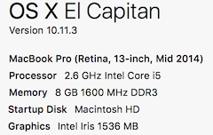
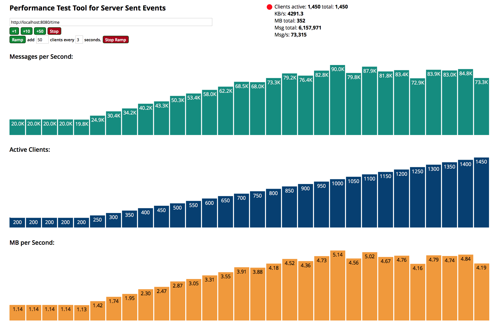
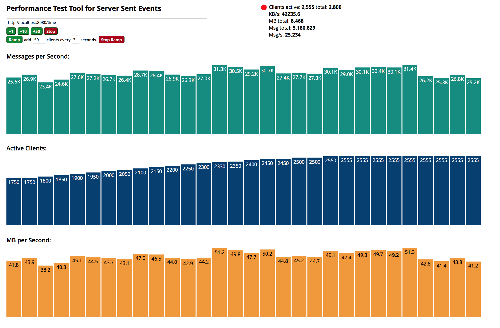
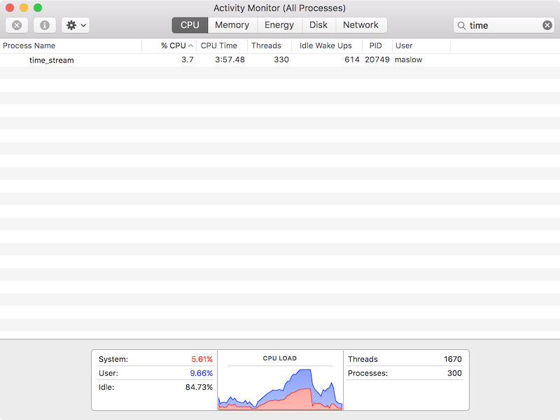

# gin-sse-simple

usage
```
go run time_stream.go
```

test
```
curl http://localhost:8080/time/
```

website client
```
http://localhost:8080/client/
```

result

```
event:message
data:2015-09-09 13:01:30.278489263 +0700 ICT

event:message
data:2015-09-09 13:01:31.275659459 +0700 ICT

event:message
data:2015-09-09 13:01:32.27942686 +0700 ICT

event:message
data:2015-09-09 13:01:33.279488214 +0700 ICT

event:message
data:2015-09-09 13:01:34.277990689 +0700 ICT
```

## Performance
 
Tested with [sse-pref][https://github.com/matthiasn/sse-perf]

####Hardware
Yeah, that my macbook.



## Connection

* max connection is about 2555 (maybe OSX 's max connections configured?).
* max speed about 50 MB/s (I tested on localhost. Why it has limits?)
* max msg/s is  about 80-90K msg/s.



This image test configured with larger message size.


## CPU

Cpu usage Instant drop after close all connection 


